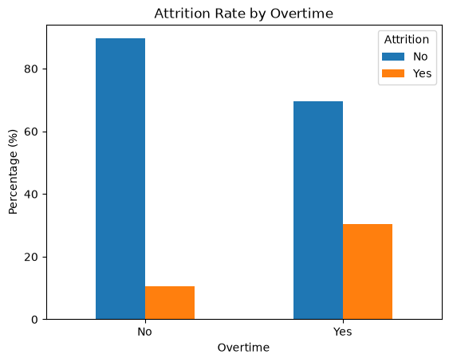
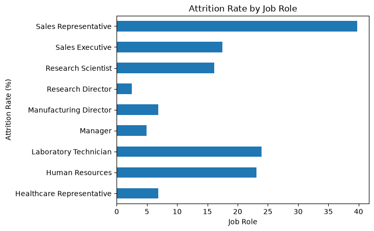
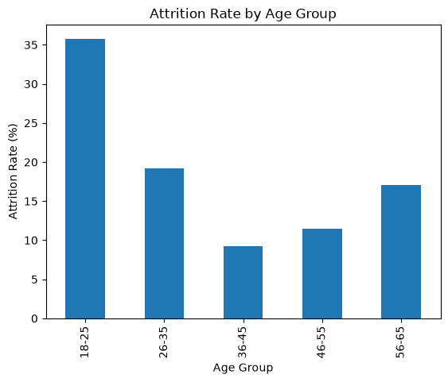
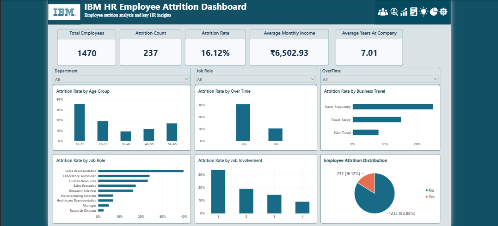

# IBM HR Employee Attrition Analysis

## Project Overview

This project analyzes employee data to identify factors associated with employee attrition and present the findings through an interactive Power BI dashboard.

The project was completed using Python for data cleaning and exploratory data analysis, followed by Power BI for dashboard creation and interactive visualization.

## Business Problem

Employee attrition can affect workforce stability and increase recruitment and training requirements.

The objective of this project is to understand:

- What factors are associated with employee attrition?
- Which employee groups show higher attrition rates?
- What insights can HR use when considering employee retention strategies?

## Dataset

The project uses the IBM HR Employee Attrition dataset.

The dataset contains:

- 1,470 employee records
- 35 original columns
- Employee information such as age, job role, job satisfaction, monthly income, overtime, business travel and attrition

During data cleaning, three constant columns were removed:

- EmployeeCount
- Over18
- StandardHours

Final dataset:

**1,470 rows × 32 columns**

## Tools & Technologies

- Python
- Pandas
- Matplotlib
- Power BI
- Jupyter Notebook in Visual Studio Code

## Data Analysis

The analysis explored factors including:

- Overtime
- Job Satisfaction
- Monthly Income
- Age and Age Groups
- Years at Company
- Job Role
- Job Level
- Job Involvement
- Business Travel

## Python Visualizations

### Attrition Rate by Overtime



### Attrition Rate by Job Role



### Attrition Rate by Age Group



## Key Findings

- Overall employee attrition rate was **16.12%**.
- Employees working overtime had an attrition rate of **30.53%**, compared with **10.44%** among employees who did not work overtime.
- Sales Representatives had the highest attrition rate among the analyzed job roles at **39.76%**.
- Employees aged **18–25** had an attrition rate of **35.77%**.
- Employees with Job Involvement Level 1 had an attrition rate of **33.73%**, compared with **9.03%** for Level 4.
- Employees who left had a lower average monthly income (**₹4,787.09**) compared with employees who stayed (**₹6,832.74**).
- Employees who left had a lower average tenure at the company (**5.13 years**) compared with employees who stayed (**7.37 years**).

## Power BI Dashboard

The Power BI dashboard provides an interactive view of the analysis using:

- KPI cards
- Attrition rate charts
- Job role analysis
- Age group analysis
- Overtime analysis
- Job involvement analysis
- Business travel analysis
- Attrition distribution
- Interactive slicers



## Business Recommendations

Based on the patterns observed in the dataset:

- Monitor excessive overtime and workload distribution.
- Review employee compensation and career-growth opportunities.
- Evaluate frequent business-travel requirements.
- Investigate role-specific reasons for higher attrition.
- Pay attention to employee engagement and job satisfaction.

## Project Structure

```text
IBM-HR-Employee-Attrition-Analysis/
│
├── IBM_HR_Employee_Attrition_Analysis.ipynb
├── dashboard.png
└── README.md

```
## Conclusion

One of the main things I learned from this project is that employee satisfaction and working conditions are important areas for HR to monitor. Factors such as overtime, job satisfaction, job involvement, compensation, and business travel showed associations with employee attrition in my analysis.

